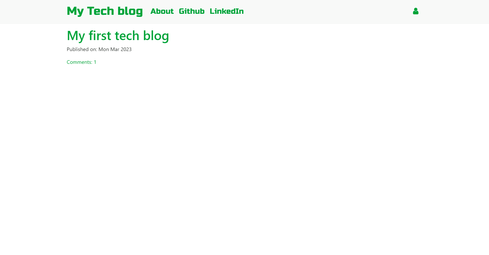
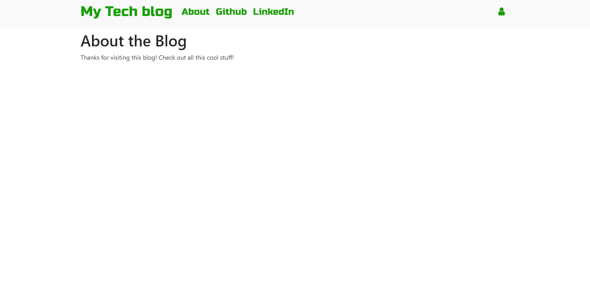
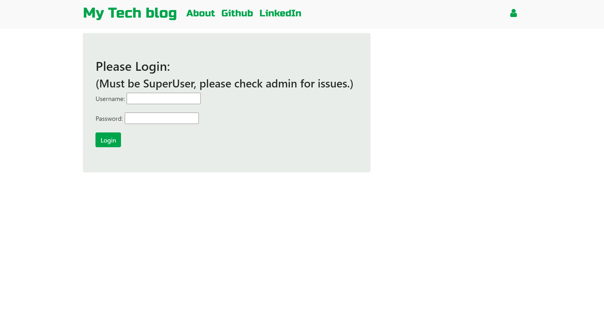
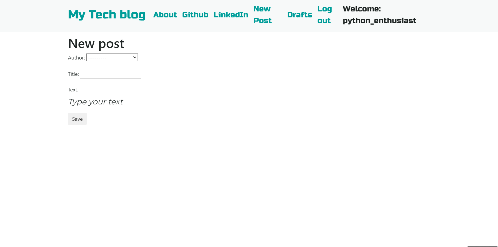
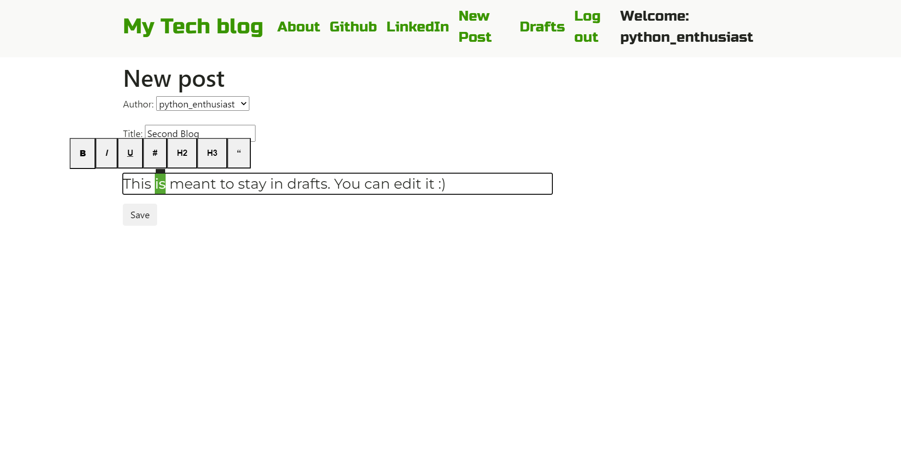
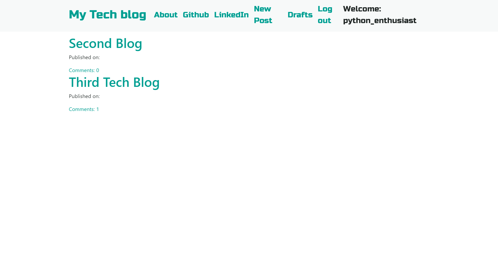
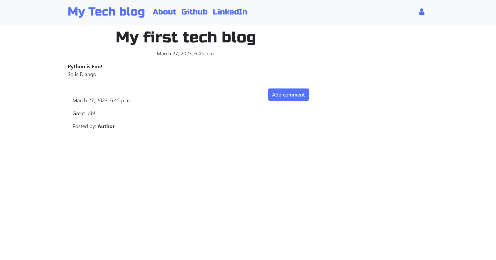
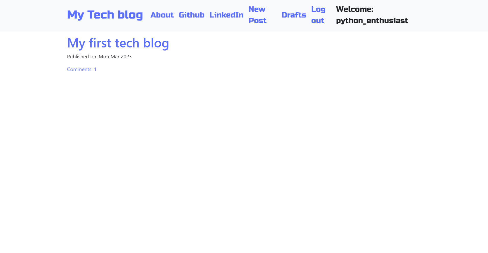
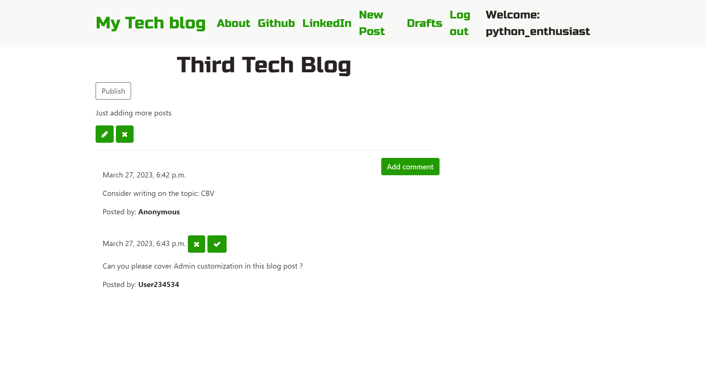

# Python Social

A tech blog site using Django! Created by following code along lectures in this [Full Stack Web Development](https://www.udemy.com/course/python-and-django-full-stack-web-developer-bootcamp/) Udemy Course. 

## Features

- A tech blog managed by authorized users
- You should be a superuser to add/edit posts/approve comments
- See posts without logging in
- Write post using common formatting options like Bold, Italic, Heading, etc ([medium.com](https://medium.com/) style)
- Delete Post
- Save post as a draft
- Add a comment
- Approve/Remove comment
- Login
- Logout

## Setup

1. Clone Repository
1. Create virtual environment and install Django Version 4. Check this [Installation Guide](https://developer.mozilla.org/en-US/docs/Learn/Server-side/Django/development_environment)
1. Activate virtual environment 
1. Go to the project root folder
    ```
    cd my_blog_site
    ```
1. Migrate Databases
    ```
    python manage.py makemigrations blog
    python manage.py migrate
    ```
1. Runserver and open the link in a browser (Chrome suggested):
    ```
    python manage.py runserver
    ```

## Testing with existing Users

1. Python Enthusiast
    ```
    Display name: python_enthusiast
    Email: python_enthusiast@example.com
    Password: ILovePython1234!
    ```

1. Python Beginner
    ```
    Display name: python_beginner_1
    Email: python_beginner_1@sample.com
    Password: ImLearningPython5678!
    ```

## Screenshots

1. Homepage without login

1. About page

1. Login

1. Create Post

1. Medium style formatting options

1. Drafts

1. Post Detail

1. Homepage Logged in

1. Post with approved and pending comments

